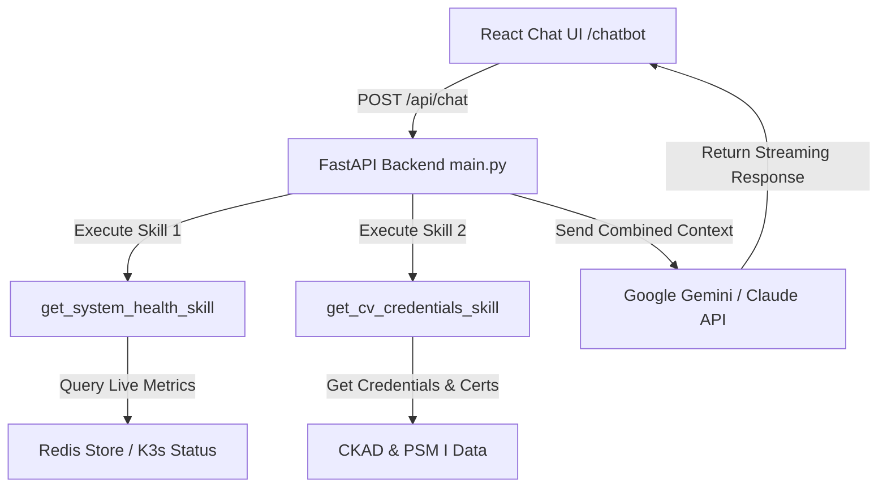

# 🤖 AI Assistant & Agent Skills Workflow

Tài liệu hướng dẫn kiến trúc, luồng xử lý và cách mở rộng hệ thống Trợ lý ảo AI & Agent Skills trong dự án **React Portfolio & System Monitor**.

---

## 📐 1. Tóm tắt Kiến trúc AI

Hệ thống AI Assistant được tích hợp sẵn ở cả 2 đầu:
* **Frontend (React)**: Giao diện chat 3D glassmorphic (`src/ChatBot.jsx`) với các gợi ý nhanh (Quick Prompts), chỉ báo trạng thái thời gian thực và định dạng Markdown.
* **Backend (FastAPI)**: Endpoint `/api/chat` tại `system-monitor/backend/main.py` tích hợp SDK Gemini / Claude và cơ chế **Agent Skills (Function Calling)**.



---

## 🛠️ 2. Chi tiết các Agent Skills trong Python Backend

Tất cả Agent Skills được định nghĩa tại `system-monitor/backend/main.py`:

### Skill 1: `get_system_health_skill()`
* **Nhiệm vụ**: Truy vấn cơ sở dữ liệu Redis (`monitor:status`) để lấy trạng thái thời gian thực của các website, độ trễ latencies (ms) và trạng thái cụm K3s Kubernetes.
* **Mã nguồn**:
```python
async def get_system_health_skill():
    status_data = await redis_client.hgetall("monitor:status")
    # Tự động tổng hợp danh sách các trang web đang ONLINE/OFFLINE
```

### Skill 2: `get_cv_credentials_skill()`
* **Nhiệm vụ**: Cung cấp dữ liệu đã xác thực về hồ sơ năng lực của anh Phúc Vũ:
  * Chứng chỉ **CKAD** (Certified Kubernetes Application Developer - Credly ID: `806d167b-...`)
  * Chứng chỉ **PSM I** (Professional Scrum Master I - Credly ID: `01e6a425-...`)
  * Kinh nghiệm viễn thông IMS (P-CSCF, IBCF) & Ngôn ngữ Erlang, C++, Python.

---

## 🚀 3. Hướng dẫn thêm Agent Skill mới

Khi bạn muốn bổ sung thêm một Skill mới (ví dụ: `get_github_commits_skill` hoặc `restart_k8s_pod_skill`):

1. Mở file `system-monitor/backend/main.py`.
2. Định nghĩa hàm async Skill mới:
```python
async def get_github_commits_skill():
    """[Agent Skill] Lấy danh sách 5 commit mới nhất từ GitHub repository."""
    # Gọi GitHub API hoặc git CLI
    return {"commits": [...]}
```
3. Gọi Skill mới bên trong endpoint `@app.post("/api/chat")`:
```python
github_skill_result = await get_github_commits_skill()
```
4. Đưa kết quả Skill vào biến `system_context` gửi cho mô hình AI.

---

## 🔑 4. Cấu hình API Keys

AI Assistant ưu tiên sử dụng **Google Gemini** và chuyển sang **Anthropic Claude** nếu Gemini quá tải.
Các biến môi trường trong cụm K3s được quản lý qua Kubernetes Secret (`monitor-secrets`):

* `GEMINI_API_KEY`: API Key dịch vụ Google Gemini AI.
* `ANTHROPIC_API_KEY`: API Key dịch vụ Anthropic Claude AI (tùy chọn fallback).
